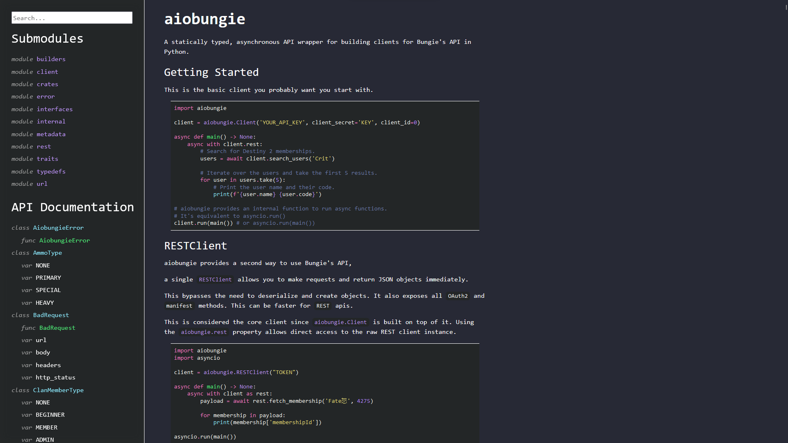
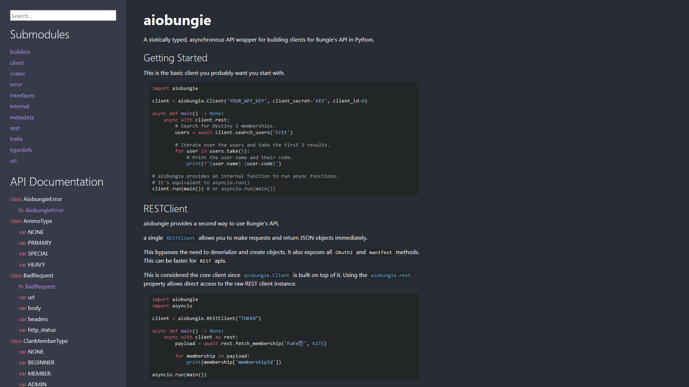
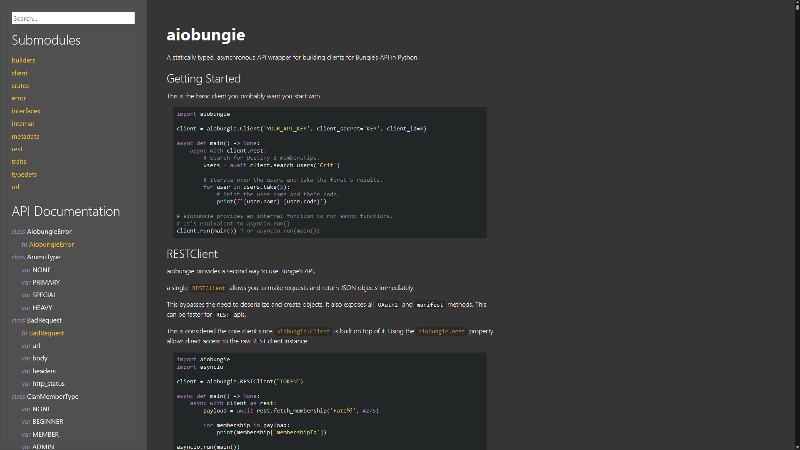

# syn

A collection of pdoc themes ready for use.

## Installation

TODO

## Usage
To output the documentation use:
```sh
pdoc <module-or-dir> -t <theme-name> -d numpy -o <out-dir> 
```

To run a local server with one of the themes use the same command without the `-o` option.

A full usage example
```sh
pdoc asyncio -t onedark -o docs
```

## Available styles

Current available styles are the ones not marked with (WIP).

* [Rust](https://doc.rust-lang.org/std/index.html): a theme that's generated by `cargo doc`
* [Dracula](https://github.com/dracula/dracula-theme): classic dracula's color scheme
* [Github](https://github.com/one-dark): github's one dark color scheme
* [Svelte](https://svelte.dev/docs/svelte-components): a theme that's used in svelte's docs (WIP)

### Overview

<table>
  <tr>
    <td> </td>
    <td></td>
   </tr> 
   <tr>
      <td></td>
      <td><p>Svelte WIP</>
  </td>
  </tr>
</table>

If you'd like to see one of those themes in action, go to their directory.

## Development
Currently the code isn't organized correctly, but i have a plan to make it simpler
to develop new themes using just `var(--color)`.

### Testing
to test a theme, there's already a module with testing cases pre-defined in it. just use `pdoc _project/core/ -t <theme>`
